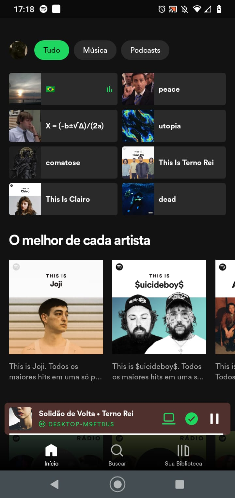

# Spotify HomePage Clone - React Native
| Referência | / | Clone| 
|--|--|--|
|   || |

### Descrição
- Projeto da aula de React Native do Serratec, com objetivo de praticar a criação de projeto, layout com flex e componentes do React Native.

### Tecnologias Usadas
- [React Native](https://reactnative.dev/)
- [TypeScript](https://www.typescriptlang.org/)
- [Expo](https://expo.dev/)

